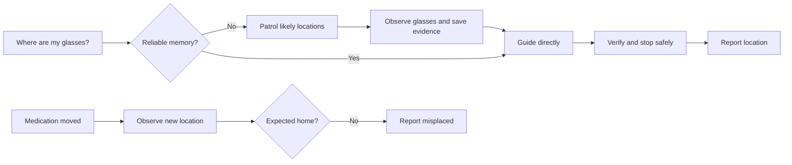
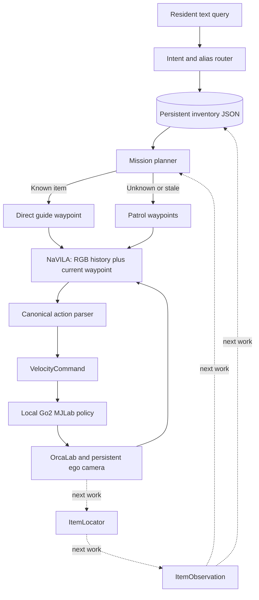
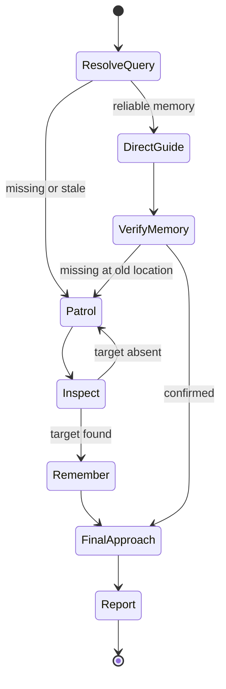

# Memory Guide Hackathon Handoff

**Last updated:** 2026-09-05  
**Branch:** `main`  
**HEAD at handoff:** `c62cff4` (`add kitchen2 and fix scene validator`)  
**Timebox:** three remaining build days

## Objective

Build an Alzheimer-support "memory guide dog" on the OrcaLab/NaVILA Go2 baseline. A resident asks a question such as "Where are my glasses?" The system should use a recent item observation when available, otherwise patrol likely locations, remember the result, and guide the resident to it.

The required demo should focus on **two objects only**:

1. Glasses case
2. Medication organizer

A phone is a stretch goal after the first two scenarios are reliable.

## Target demo



The implementation should remain honest about simulator-only evidence. Observations obtained from Orca actor transforms must use `source: "sim_ground_truth"`, not claim visual recognition.

---

## System architecture



Do not change the stable NaVILA-to-locomotion contract for this hack. Keep NaVILA responsible for visual navigation and keep inventory/mission decisions above it.

---

## What is already built

### Organizer baseline

- OrcaLab scene reuse and alignment.
- Local Go2 locomotion policy through MJLab/MuJoCo Warp.
- Persistent ego RGB camera and live monitor.
- Exactly eight RGB history frames sent to NaVILA.
- Local NaVILA server or AWS SSM port-forward to `127.0.0.1:54321`.
- Strict canonical actions: forward, turn left/right, and stop.
- Saved RGB frames, VLM outputs, motion chunks, final state, and `measurements.json`.

Important baseline files:

- [`scripts/run_orcalab_scene_locomotion.sh`](../scripts/run_orcalab_scene_locomotion.sh)
- [`src/navila_orca/runner.py`](../src/navila_orca/runner.py)
- [`src/navila_orca/actions.py`](../src/navila_orca/actions.py)
- [`src/navila_orca/contracts.py`](../src/navila_orca/contracts.py)
- [`src/navila_orca/render/orca.py`](../src/navila_orca/render/orca.py)
- [`src/navila_orca/render/orca_camera.py`](../src/navila_orca/render/orca_camera.py)

### Memory Guide MVP

Implemented in [`src/navila_orca/memory_guide.py`](../src/navila_orca/memory_guide.py):

- Deterministic query classification.
- Item and place alias resolution.
- Supported intents:
  - `find_item`
  - `navigate_place`
  - `patrol`
  - `leaving_checklist`
- Versioned JSON inventory.
- Atomic inventory writes.
- Observation timestamps and confidence.
- 24-hour confidence half-life.
- Direct guidance when an observation is recent and sufficiently confident.
- Patrol generation when an item is missing, stale, or uncertain.
- CLI commands for `plan`, `remember`, and `list`.

Catalog and search locations are in:

- [`assets/memory_guide_catalog.json`](../assets/memory_guide_catalog.json)

Launchers:

- [`scripts/memory_guide.sh`](../scripts/memory_guide.sh): inventory CLI wrapper.
- [`scripts/run_orcalab_memory_guide.sh`](../scripts/run_orcalab_memory_guide.sh): query planner followed by the existing locomotion launcher.

Generated files:

- `outputs/memory_guide/inventory.json`
- `outputs/memory_guide/latest_plan.json`
- `outputs/memory_guide/latest_waypoints.txt`
- `outputs/scene_locomotion_smoke/measurements.json`
- `outputs/scene_locomotion_smoke/frames/`

### Raised inspection camera

The Memory Guide launcher defaults to:

- Camera mount position `(0.1, 0, 1.0)` with a 20-degree downward pitch
- Stabilized camera horizon

Runner arguments supplied after the query override those defaults.

### Dining-scene ground fix

`SimpleMovement_DiningTable` exports its floor as a large box slab rather than a MuJoCo plane. The validator now accepts either:

- A plane, or
- A large, shallow, fixed, level slab with the required contact profile.

Safety constraints include minimum horizontal half-extent, maximum thickness, world welding, level orientation, and exact Go2 contact properties.

Implementation and tests:

- [`src/navila_orca/orcalab_runtime/scene_options.py`](../src/navila_orca/orcalab_runtime/scene_options.py)
- [`tests/test_scene_options.py`](../tests/test_scene_options.py)

The actual dining-scene floor was compiled and validated as `box_slab`, size `[6.0, 10.0, 0.1]`.

### Test status

At handoff:

- `105 passed`
- `1 skipped` optional GPU smoke test

Run tests with the project-selected environment:

```bash
source scripts/orcalab_env.sh
navila_orca_resolve_runtime
"${NAVILA_ORCA_PYTHON}" -m pytest -q
```

---

## What is not built yet

The current Memory Guide is a **query-to-waypoint generator**, not yet a complete autonomous inventory system.

Missing functionality:

- No `ItemLocator` abstraction.
- No runtime item-transform lookup.
- No automatic camera-based or simulator-ground-truth observation.
- No automatic inventory update after reaching a search location.
- Patrol is a fixed waypoint sequence.
- Patrol cannot stop early when an item is found.
- Remembered locations are not verified before final success.
- No stale-memory fallback during a running mission.
- No medication `present` versus `misplaced` classification.
- No structured per-mission report separate from `measurements.json`.
- No dedicated UI, speech output, or caregiver service. A command-line voice
  query path is now available through `run_orcalab_memory_guide.sh --voice`.
- No real-Go2 sensor, RGB-D, LiDAR, ROS, or SLAM adapter.

Manual `remember` is still required:

```bash
./scripts/memory_guide.sh remember \
  --item glasses \
  --location "the dining table in the kitchen" \
  --room "dining area" \
  --confidence 0.95
```

---

## Required next interfaces

Define these before parallel implementation. Mission and memory code must not import OrcaLab directly.

### `ItemObservation`

Recommended fields:

```text
item_id: str
room: str | None
location_text: str
world_position: [x, y, z] | None
coordinate_frame: str
observed_at: ISO-8601 UTC
confidence: float
source: sim_ground_truth | rgbd_detection | monocular_detection | user_confirmed
evidence_frame: str | None
```

### `ItemLocator`

Recommended behavior:

```text
locate(target_item, robot_state, frame) -> ItemObservation | None
```

Implementations:

1. `OrcaActorItemLocator` for the three-day simulator demo.
2. Future `RgbdItemLocator` for real deployment.

### Mission state



A practical integration point is the accepted waypoint `stop` path in `NavigationRunner`. Before advancing to the next waypoint, invoke an optional inspection callback. Its result must be able to:

- Continue to the next waypoint.
- End the patrol as found.
- Mark old memory stale and switch to patrol.

Keep the callback optional so all existing baseline behavior and tests remain unchanged.

---

## Prioritized TODOs for the remaining three days

### P0 — Scene assets and semantic names

Owner: scene/simulation agent

- [ ] Add a visually distinct glasses-case actor.
- [ ] Add a visually distinct medication-organizer actor.
- [ ] Use stable names such as `memory_glasses_case` and `memory_medication_organizer`.
- [ ] Place each object at one home location and one alternate/misplaced location.
- [ ] Ensure each location has an open inspection viewpoint, not a gap between chairs.
- [ ] Record actor paths and expected semantic locations in the catalog.
- [ ] Confirm visibility using the raised camera.

Acceptance: both actors are discoverable by name and visible from safe floor positions.

### P0 — Simulator item locator

Owner: simulation/backend agent

- [ ] Introduce the portable `ItemLocator` and `ItemObservation` types.
- [ ] Implement `OrcaActorItemLocator` behind that interface.
- [ ] Obtain current actor transforms using known actor paths and the OrcaLab edit API, or use the authored scene transforms if runtime lookup is unavailable.
- [ ] Correctly compose nested/local actor transforms into the world frame.
- [ ] Use robot-to-item range and bearing as a simulator visibility gate.
- [ ] Save the current RGB frame as evidence.
- [ ] Mark every observation `source: "sim_ground_truth"`.
- [ ] Add pure unit tests with a fake locator.

Available installed OrcaLab APIs include `get_pending_actor_transform_batch`, `get_entity_hierarchy_batch`, and `get_actor_asset_aabb`.

Acceptance: approaching either object automatically produces a versioned observation with location, world position, timestamp, confidence, source, and evidence.

### P0 — Dynamic mission execution

Owner: integration agent

- [ ] Add an optional inspection/waypoint callback to `NavigationRunner` without changing the velocity contract.
- [ ] Execute patrol one location at a time.
- [ ] Inspect after NaVILA stops at each search waypoint.
- [ ] End patrol immediately when the target is found.
- [ ] Persist the observation automatically.
- [ ] Verify direct-memory destinations.
- [ ] Mark an incorrect remembered location stale and continue with patrol.
- [ ] Add maximum search locations and mission timeout.
- [ ] Preserve existing static-waypoint behavior when no callback is supplied.

Acceptance: unknown glasses patrol and remember; a repeated query guides directly; moved glasses invalidate old memory and patrol again.

### P0 — Medication status

Owner: memory/mission agent

- [ ] Add `expected_location` to the medication catalog entry.
- [ ] Classify observation as `present`, `misplaced`, `missing`, or `stale`.
- [ ] Report location and confidence without giving dosage or medical advice.
- [ ] Add tests for correct and misplaced locations.

Acceptance: medication in the kitchen home is `present`; medication on the dining table is `misplaced`.

### P1 — Safe inspection prompts

Owner: navigation/prompt agent

- [ ] Replace generic surface prompts with authored open-side viewpoints.
- [ ] Maintain approximately 1–1.5 m stand-off from furniture.
- [ ] Explicitly avoid moving between dining chairs.
- [ ] Rotate in clear floor space to inspect before approaching.
- [ ] Test each route repeatedly from the chosen demo start pose.

Acceptance: evidence images are unobstructed and the Go2 does not become trapped behind a chair.

### P1 — Mission report and presentation evidence

Owner: demo/QA agent

- [ ] Write `outputs/memory_guide/latest_mission_report.json`.
- [ ] Include query, parsed intent, mode, searched locations, result, item status, confidence, evidence frame, decisions, and final distance.
- [ ] Run each required scenario at least five times.
- [ ] Record success rate and failure reasons.
- [ ] Preserve one clean run directory per demo scenario.
- [ ] Record the final video and screenshots.

Acceptance: each demo result is independently inspectable without relying only on terminal output.

### P2 — Only if P0/P1 are stable

- [ ] Add a phone actor and scenario.
- [ ] Add a lightweight visual verifier as secondary evidence.
- [ ] Draw a simple 2D semantic map with item markers.
- [ ] Annotate evidence images with target name and confidence.

---

## Explicitly cut from the three-day scope

Do not implement these before the required scenarios are reliable:

- Full SLAM or occupancy-grid mapping
- LiDAR or ROS/Nav2 integration
- RGB-D adapter and calibration
- Detector training
- NaVILA SFT/LoRA
- Locomotion retraining
- Jumping, standing tall, or custom joint poses
- Grasping or carrying objects
- Text-to-speech
- Mobile application or cloud database
- GPS/family tracking
- Authentication/caregiver backend
- Food-expiry reasoning
- Documents, passport, bank passbook, dentures, shoes, and TV remote
- Multiple residents or multiple instances of one item

For a future real Go2, replace `OrcaActorItemLocator` with an RGB-D/SLAM-backed locator while preserving the observation and mission interfaces.

---

## Performance notes

AWS only hosts NaVILA inference. Go2 policy inference, MJWarp physics, OrcaLab rendering, pose streaming, PNG capture, and the live monitor remain local.

The current launch path uses synchronous OrcaLab pose updates and PNG captures. If visual FPS is too low, use:

```bash
./scripts/run_orcalab_memory_guide.sh \
  --query "Where are my glasses?" \
  --state-stream-interval 0.1 \
  --monitor-interval 0.5 \
  --image-interval 0.5
```

For diagnosis, `--no-live-monitor` removes frequent monitor captures. Do not switch to WebSocket transport for the current OrcaStudio build; its H.264 endpoint starts but does not enqueue usable packets. Do not spend the remaining time on asynchronous pipeline refactoring.

---

## Runtime procedures

### OrcaLab

```bash
./scripts/start_orcalab_gui.sh
```

Open the intended dining/kitchen layout before launching navigation.

### Local NaVILA

```bash
./scripts/start_navvlm_server.sh
```

### Managed AWS NaVILA

Use the documented SSM port-forward so the service is reachable at `127.0.0.1:54321`. The simulation command is unchanged after the tunnel is established.

### Plan without motion

```bash
./scripts/run_orcalab_memory_guide.sh \
  --query "Where are my glasses?" \
  --plan-only
```

### Integrated run

```bash
./scripts/run_orcalab_memory_guide.sh \
  --query "Where are my glasses?"
```

---

## Three-day delegation

### Day 1

Parallel work after agreeing on actor names and observation schema:

- Scene agent: add two actors and inspection positions.
- Backend agent: implement `ItemLocator` and simulator locator.
- Integration agent: add optional runner inspection callback and fake-locator tests.
- QA agent: prepare deterministic layouts, reset procedure, and scenario checklist.

End-of-day gate: unknown glasses can produce an automatic observation and evidence frame. If not, stop all stretch work and finish this path first.

### Day 2

- Connect locator to dynamic patrol termination.
- Persist observations automatically.
- Verify remembered locations.
- Add medication expected-location classification.
- Tune safe table/kitchen viewpoints.

End-of-day gate: all three required scenarios work end to end. Freeze features.

### Day 3

- Run each scenario at least five times.
- Fix only crashes, route ambiguity, furniture trapping, incorrect stopping, and missing artifacts.
- Capture final evidence, measurements, screenshots, and video.
- Stop feature development several hours before submission.

Avoid multiple agents editing `runner.py` simultaneously. The integration owner should merge callback changes; other agents should work through the agreed interfaces and tests.

---

## Required demo scenarios

1. **Unknown glasses**
   - Query has no reliable memory.
   - Robot patrols.
   - Simulator locator observes glasses.
   - Inventory and evidence update automatically.

2. **Remembered glasses**
   - Repeat the query.
   - Robot goes directly to the remembered location.
   - Location is verified before success.

3. **Misplaced medication**
   - Move medication away from its expected home.
   - Robot observes the new location.
   - Report says `misplaced` and provides evidence.

Definition of done: these three scenarios are repeatable, produce structured artifacts, and do not require manual inventory editing during the recorded demonstration.

---

## Repository hygiene

At handoff, the tracked Memory Guide and validator work is committed through `c62cff4`. One unrelated untracked file was present:

- `scripts/mock_infer.py`

Do not delete, commit, or modify it without first determining whether it is another contributor's work.
