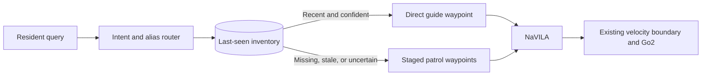

# Memory Guide MVP

The Memory Guide adds a deterministic mission-intelligence layer in front of
NaVILA. It classifies a resident request, looks up the requested item in a
persistent inventory, and generates staged visual-navigation waypoints.
NaVILA and the existing `VelocityCommand`/Go2 locomotion boundary remain
unchanged.

## Behavior



An observation is used for direct guidance only when its age and decayed
confidence pass the configured gates. By default, confidence has a 24-hour
half-life, direct guidance requires effective confidence of at least `0.65`,
and observations older than 24 hours cause a patrol.

## Record an observation

After placing a visible glasses-case asset on the dining table, record its
last-seen semantic location:

```bash
./scripts/memory_guide.sh remember \
  --item glasses \
  --location "the dining table in the kitchen" \
  --room "dining area" \
  --confidence 0.95
```

The default mutable inventory is written to
`outputs/memory_guide/inventory.json`. Use `--inventory PATH` before the
subcommand to select another inventory.

## Inspect the routing decision without moving

```bash
./scripts/run_orcalab_memory_guide.sh \
  --query "Where are my glasses?" \
  --plan-only
```

This writes `outputs/memory_guide/latest_plan.json` and
`outputs/memory_guide/latest_waypoints.txt`.

## Speak the resident query

The launcher also accepts a voice query. `--voice` records an 8-second,
16 kHz mono clip from the ALSA microphone, transcribes it with FireRedASR2-AED,
and then sends the resulting text through the same planner:

```bash
export NAVILA_VOICE_PYTHON=/path/to/fireredasr2s/bin/python
export NAVILA_FIRERED_ROOT=/path/to/FireRedASR2S
export NAVILA_FIRERED_MODEL=/path/to/pretrained_models/FireRedASR2-AED

# Install ADC support in the Python environment that runs voice_query.
# For the deployed HTTP backend, this can be the modal-deploy environment.
python -m pip install google-auth

./scripts/run_orcalab_memory_guide.sh --voice
```

To translate Mandarin or Chinese-dialect transcripts into English before the
planner runs, add `--voice-translate`:

```bash
./scripts/run_orcalab_memory_guide.sh --voice --voice-translate
```

English transcripts bypass Google Translation. Chinese transcripts are sent to
Cloud Translation's REST API using Application Default Credentials, with the project
inferred from ADC or `GOOGLE_CLOUD_PROJECT`/`NAVILA_GOOGLE_CLOUD_PROJECT`.
When using the deployed HTTP ASR backend, set `NAVILA_VOICE_PYTHON` to the
Python environment containing `google-auth`; the OrcaLab environment remains
reserved for the planner and simulator.
The launcher prints the original transcript and translated query on stderr;
only the English query is passed to the Memory Guide planner.

Use `--voice-duration SECONDS` and `--voice-device DEVICE` to adjust capture,
or use an existing recording for a repeatable run:

```bash
./scripts/run_orcalab_memory_guide.sh --voice-file /path/to/query.wav --plan-only
```

The FireRed source and weights are intentionally kept outside the pinned
OrcaLab environment. For a managed GPU deployment, use the Orca-specific
Modal app:

```bash
conda create -n modal-deploy python=3.11 pip -y
conda activate modal-deploy
python -m pip install --upgrade modal
modal token info

cd NaVILA-Orca
modal deploy --stream-logs modal/firered_asr.py
```

The first container startup downloads FireRedASR2-AED into the persistent
Modal Volume. Validate the deployment before connecting Orca:

```bash
modal run modal/firered_asr.py --audio-path /path/to/query.wav
curl https://YOUR_MODAL_HOST/health
```

Then point the launcher at the deployed ASR-only endpoint:

```bash
export NAVILA_VOICE_BACKEND=http
export NAVILA_VOICE_ENDPOINT=https://YOUR_MODAL_HOST/transcribe/wav
./scripts/run_orcalab_memory_guide.sh --voice
```

This Orca Modal app only runs FireRedASR2-AED; it does not require an OpenAI
secret and does not run the Hackomania LLM/TTS pipeline.

`--query` remains supported and is mutually exclusive with the voice query
options. The launcher prints the recognized text before creating the plan.

## Nova Micro query routing

The default query router is deterministic and does not contact a language
model. For open-ended requests such as “Where did I put my bread?”, install
the optional Bedrock client in the OrcaLab environment:

```bash
/home/kohming/Orca_VLN/.conda/envs/orcalab/bin/python \
  -m pip install -e '.[bedrock]'
```

Configure AWS credentials using the normal boto3 credential chain. Bedrock
mode defaults to `ap-southeast-1`; override it if needed, then run:

```bash
./scripts/run_orcalab_memory_guide.sh \
  --query "Where did I put my bread?" \
  --llm-mode bedrock \
  --plan-only
```

Bedrock mode defaults to the AWS CLI profile
`683803166476_hack2026_IsbUsersPS` from `~/.aws`. Override it with
`NAVILA_BEDROCK_PROFILE` or `--bedrock-profile` when needed.

Nova Micro only classifies the request and extracts an item/place ID. The
local planner still validates that result, applies inventory freshness, maps
known locations, and generates the natural-language NaVILA waypoints. It does
not ask Bedrock for movement actions or poses. `--bedrock-model-id` and
`--bedrock-profile` can override the defaults.

## OpenAI query routing

OpenAI is a separate provider path and does not use AWS credentials. Install
the optional SDK in the OrcaLab environment:

```bash
/home/kohming/Orca_VLN/.conda/envs/orcalab/bin/python \
  -m pip install -e '.[openai]'
```

Set the API key in the environment and select GPT-5.6 Luna:

```bash
export OPENAI_API_KEY="..."
./scripts/run_orcalab_memory_guide.sh \
  --query "Where did I put my bread?" \
  --llm-mode openai \
  --plan-only
```

The OpenAI provider uses strict Responses API JSON-schema output and returns
the same route fields as the Bedrock provider. `--openai-model-id` and
`--openai-base-url` can override the defaults. The base URL is useful for an
OpenAI-compatible service, but the default is the official OpenAI API.

## Run the integrated demonstration

Start OrcaLab and either the local NaVILA server or the documented AWS SSM
port-forward. Then run:

```bash
./scripts/run_orcalab_memory_guide.sh \
  --query "Where are my glasses?"
```

If the glasses observation is recent and confident, the dog receives one
direct waypoint. If memory is absent or unreliable, it receives the catalog's
staged search locations. Existing runner options may be appended normally.

The Memory Guide launcher uses a stabilized camera mount at `(0.1, 0, 1.2)` by
default so the dog can inspect tables and kitchen counters. A different mount
can be supplied with `--camera-mount-position X Y Z`; arguments supplied to the
launcher take precedence over this default.

## Teleop semantic map and multi-view patrols

After a keyboard-teleop collection, the development launcher automatically
rebuilds a pose-tagged semantic map from
`outputs/memory_guide/latest-teleop/teleop.json` into
`outputs/memory_guide/semantic_map.json`. When a search location matches a
recorded location, its `front`, `left`, `rear`, and `right` anchors are retained
as coverage metadata inside one location waypoint. The waypoint asks NaVILA to
complete the visual sweep before advancing, while keeping a patrol over four
search locations as four outer navigation stages.

You can build the map explicitly:

```bash
./scripts/memory_guide.sh map-build \
  --teleop-json outputs/memory_guide/latest-teleop/teleop.json \
  --output outputs/memory_guide/semantic_map.json
```

Normal missions use it automatically:

```bash
./scripts/memory_guide_dev.sh run --query "Where is my bread?"
```

Use `--no-semantic-map` on the underlying memory-guide launcher to restore the
legacy text-only patrol. Locations without a matching teleop anchor remain
explicit text fallbacks; they are not silently mapped to a nearby location.
The current NaVILA TCP protocol is an action-only navigation protocol, so the
generated plan records all inspection frames and poses but does not yet run an
independent object-verification model or update inventory automatically.

## MVP boundary

This first version provides query routing, persistent memory, freshness logic,
and mission generation. Patrol completion does not yet update memory
automatically: use `memory_guide.sh remember` after a verified observation.
Automatic frame detection and early patrol termination are the next extension.
