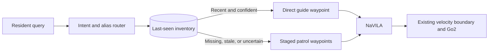

# Memory Guide MVP

The Memory Guide adds a deterministic mission-intelligence layer in front of
NaVILA. It classifies a resident request, looks up the requested item in a
persistent inventory, and generates staged visual-navigation waypoints.
NaVILA and the existing `VelocityCommand`/Go2 locomotion boundary remain
unchanged.

## Behavior



An observation is used for direct guidance only when its age and decayed
confidence pass the configured gates. By default, confidence has a 24-hour
half-life, direct guidance requires effective confidence of at least `0.65`,
and observations older than 24 hours cause a patrol.

## Record an observation

After placing a visible glasses-case asset on the dining table, record its
last-seen semantic location:

```bash
./scripts/memory_guide.sh remember \
  --item glasses \
  --location "the kitchen-facing side of the dining table" \
  --room "dining area" \
  --confidence 0.95
```

The default mutable inventory is written to
`outputs/memory_guide/inventory.json`. Use `--inventory PATH` before the
subcommand to select another inventory.

## Inspect the routing decision without moving

```bash
./scripts/run_orcalab_memory_guide.sh \
  --query "Where are my glasses?" \
  --plan-only
```

This writes `outputs/memory_guide/latest_plan.json` and
`outputs/memory_guide/latest_waypoints.txt`.

## Run the integrated demonstration

Start OrcaLab and either the local NaVILA server or the documented AWS SSM
port-forward. Then run:

```bash
./scripts/run_orcalab_memory_guide.sh \
  --query "Where are my glasses?"
```

If the glasses observation is recent and confident, the dog receives one
direct waypoint. If memory is absent or unreliable, it receives the catalog's
staged search locations. Existing runner options may be appended normally.

## MVP boundary

This first version provides query routing, persistent memory, freshness logic,
and mission generation. Patrol completion does not yet update memory
automatically: use `memory_guide.sh remember` after a verified observation.
Automatic frame detection and early patrol termination are the next extension.