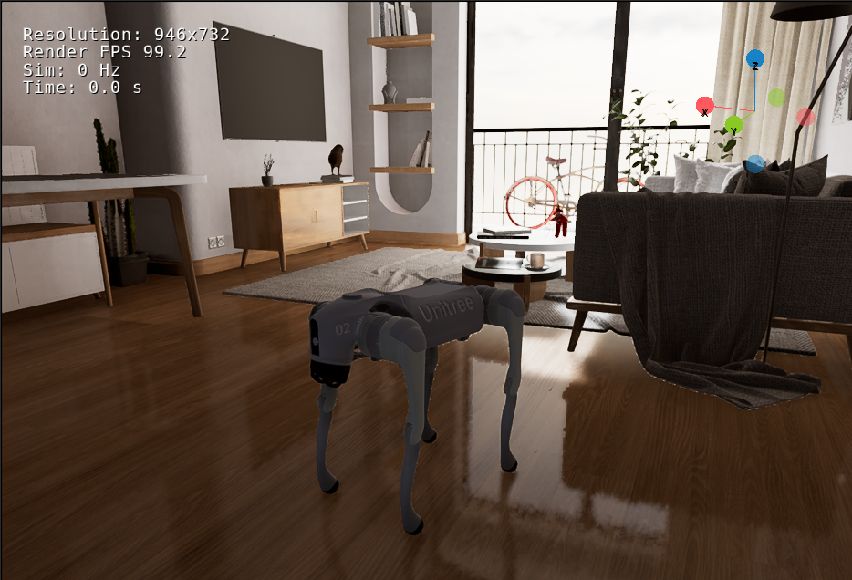
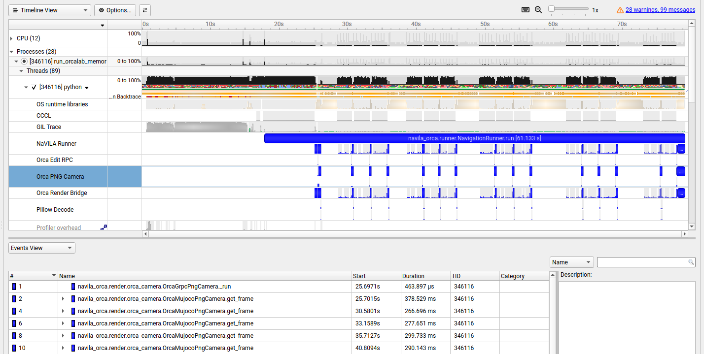

# rAIner: companion for seniors with dementia

<p align="center">
  
</p>

An agentic visual-language navigation proof of concept for a Unitree Go2 in
OrcaLab. A language query is converted into a small search plan; NaVILA uses
eight ego-camera frames to choose the next movement; the navigation runner
executes that movement in MuJoCo/MJLab and mirrors the pose into OrcaLab.

```text
query → Memory Guide plan → eight RGB frames → NaVILA action
      → Go2 locomotion → OrcaLab scene/camera → next observation
```

## Tech stack and data flow

The stack has two runtime paths and three model stages. FireRedASR and the
Bedrock/OpenAI router belong to the high-level voice/query path; NaVILA is the
separate visual-control path:

| Layer | Technology | Responsibility |
| --- | --- | --- |
| Voice input | ALSA `arecord` | Records one 16 kHz, mono WAV query. |
| Speech recognition | Modal-hosted FireRedASR2-AED HTTP service (NVIDIA T4) | Converts the WAV into plain text. It does not plan movement. |
| Query routing | Amazon Bedrock primary (`amazon.nova-micro-v1:0`); OpenAI Responses API backup (`gpt-5.6-luna`) | Classifies the request and extracts one target using the local item/place catalog. |
| Mission planning | Python Memory Guide | Deterministically resolves inventory and semantic-map data into search locations and waypoint instructions. |
| Visual navigation | NaVILA, optionally with the project LoRA adapter | Receives eight ego-camera RGB frames plus one waypoint and predicts the next movement action. |
| Model adaptation | Reviewed eight-frame decision samples + upstream NaVILA LoRA training | Adapts high-level visual actions without changing the Go2 locomotion policy. Training requires a GPU environment that owns the NaVILA checkpoint. |
| Locomotion | MJLab/MuJoCo Go2 policy | Converts the movement action into simulated Go2 control. |
| World and rendering | OrcaLab / OrcaGym | Runs the scene, mirrors robot pose, and supplies camera observations. |

The voice-to-navigation path is:

```text
microphone
  → arecord (16 kHz mono WAV)
  → HTTP upload to Modal FireRedASR2-AED
  → transcript, for example "Where is my bread?"
  → Amazon Bedrock primary (strict JSON query route)
    or OpenAI `gpt-5.6-luna` backup when selected
  → Memory Guide + inventory + semantic map
  → waypoint instructions
  → eight camera frames
  → NaVILA TCP server
  → Go2 movement chunk
  → OrcaLab pose/camera update
```

The Bedrock/OpenAI model is deliberately a high-level query router here. Its
structured output contains `intent`, `target_type`, `target_id`, `confidence`,
and a logging-only `rationale`; it must not return coordinates, motor commands,
or waypoints. The local planner owns map resolution and waypoint generation.
NaVILA is the model that closes the visual navigation loop and chooses actions
from the eight-frame observation. A typed `--query` skips audio capture and
FireRedASR and starts at the transcript stage.

The repository's Bedrock adapter currently uses Amazon Nova Micro as its
primary router. `gpt-5.6-luna` is the OpenAI API backup; it is not silently
invoked unless OpenAI mode is selected. This keeps provider choice explicit and
avoids hiding an AWS credential, model-access, or billing failure during a
demo. To use a different Bedrock deployment, pass its model ID with
`--bedrock-model-id`.

### Run Modal FireRedASR → Bedrock primary

FireRedASR is deployed separately as a small Modal HTTP service. Deploy it
once from the `NaVILA-Orca` directory after authenticating the Modal CLI:

```bash
conda activate modal-deploy
cd /path/to/Orca_VLN/NaVILA-Orca
modal deploy --stream-logs modal/firered_asr.py
```

The deployment uses an NVIDIA T4, keeps the FireRed weights in a persistent
Modal Volume, and exposes `/health` and `/transcribe/wav`. Set the resulting
base URL in the OrcaLab/planner environment. Keep AWS/OpenAI credentials and
the Modal URL in the shell environment or an untracked `.env` file; do not
commit them.

```bash
cd /path/to/Orca_VLN/NaVILA-Orca

export NAVILA_VOICE_BACKEND=http
export NAVILA_VOICE_ENDPOINT='https://<modal-host>/transcribe/wav'

export AWS_PROFILE='your-bedrock-profile'
export AWS_DEFAULT_REGION='ap-southeast-1'

./scripts/run_orcalab_memory_guide.sh \
  --voice \
  --voice-backend http \
  --voice-endpoint "$NAVILA_VOICE_ENDPOINT" \
  --llm-mode bedrock \
  --bedrock-profile "$AWS_PROFILE" \
  --bedrock-region "$AWS_DEFAULT_REGION" \
  --bedrock-model-id amazon.nova-micro-v1:0
```

`--voice` records for eight seconds on the OrcaLab host, then uploads the WAV
to Modal. Use `--voice-file query.wav` to send an existing recording instead.
The `memory_guide_dev.sh run` convenience wrapper currently accepts typed
`--query` input; use `run_orcalab_memory_guide.sh` directly for voice input.

Check the deployed service before running a query:

```bash
curl 'https://<modal-host>/health'
```

The response should report `status: ok`, backend `fireredasr2-aed`, and an
NVIDIA T4 GPU. The local `--voice-backend firered` path remains available for
development, but it requires FireRedASR2S and the AED weights installed in a
separate Python environment; it is not the deployed demo path.

Add `--voice-translate` when the spoken query is Mandarin or another
Han-character transcript and English planning text is required. This uses
Google Cloud Translation with Application Default Credentials only for Han
text; English transcripts bypass the translation request.

If Bedrock is unavailable, use the OpenAI backup explicitly:

```bash
export OPENAI_API_KEY='your-local-key'

./scripts/run_orcalab_memory_guide.sh \
  --voice \
  --voice-backend http \
  --voice-endpoint "$NAVILA_VOICE_ENDPOINT" \
  --llm-mode openai \
  --openai-model-id gpt-5.6-luna
```

For a typed query through the Bedrock primary:

```bash
./scripts/memory_guide_dev.sh run \
  --query "Where is my bread?" \
  --llm-mode bedrock \
  --bedrock-model-id amazon.nova-micro-v1:0
```

For a typed query through the OpenAI backup:

```bash
./scripts/memory_guide_dev.sh run \
  --query "Where is my bread?" \
  --llm-mode openai \
  --openai-model-id gpt-5.6-luna
```

## Requirements

- Ubuntu 22.04/24.04, Git, Conda, and an NVIDIA driver for `nvidia-smi`.
- OrcaLab 26.7.1 with access to the `VLN_Presentation` and `unitree_robots`
  assets.
- An NVIDIA GPU with enough memory for the selected NaVILA checkpoint. A
  separate GPU server can be used for NaVILA inference.

Model weights, OrcaLab subscriptions, credentials, and generated run outputs
are intentionally not part of the repository.

## Install and verify

From the repository root:

```bash
./NaVILA-Orca/scripts/setup_all.sh
./NaVILA-Orca/scripts/doctor.sh
```

The setup creates two project-local environments under `.conda/envs/` and
downloads the reviewed NaVILA checkpoint. Launchers resolve these environments
themselves; shell activation is optional.

## Recommended local run

This is the simplest complete development loop. Run the first command in one
terminal and keep it open:

```bash
cd /path/to/Orca_VLN/NaVILA-Orca

NAVILA_SERVER_MODE=local \
./scripts/memory_guide_dev.sh start
```

The supervisor starts OrcaLab, the external simulation, and the local NaVILA
server. In a second terminal, run a query:

```bash
cd /path/to/Orca_VLN/NaVILA-Orca
./scripts/memory_guide_dev.sh run --query "Where are my glasses?"
```

Stop the stack with:

```bash
./scripts/memory_guide_dev.sh stop
```

## OrcaLab MCP development loop

OrcaLab must be running before the OrcaLab MCP connector is available. Once the
GUI has initialized and MCP is listening on port `12345`, the connector can
inspect simulation state, actors, transforms, layouts, and viewport screenshots,
and can start or stop simulation. The supervisor waits for a successful MCP
handshake before starting the rest of the stack.

The automated development loop loads the `SimpleMovement_DiningTable` scene with
the `dethread/kitchen2.json` layout, starts external simulation mode, and
manages the NaVILA backend:

```bash
cd /home/kohming/Orca_VLN/NaVILA-Orca

./scripts/memory_guide_dev.sh start
./scripts/memory_guide_dev.sh run --query "Where are my glasses?"
./scripts/memory_guide_dev.sh status
./scripts/memory_guide_dev.sh inspect
./scripts/memory_guide_dev.sh stop
```

The default supervisor backend is the managed AWS SSM tunnel. Set
`NAVILA_SERVER_MODE=local` to use the local NaVILA server. Each run is stored
under `outputs/memory_guide/runs/<run-id>/`, with
`outputs/memory_guide/latest-run` pointing to the newest run.

When launching OrcaLab manually, MCP requires the GUI to be started with the
scene and layout selected. The NVIDIA runtime used during development was:

```bash
VK_ICD_FILENAMES=/usr/share/vulkan/icd.d/nvidia_icd.json \
  ~/Orca_VLN/NaVILA-Orca/scripts/start_orcalab_gui.sh \
    --scene SimpleMovement_DiningTable \
    --layout /home/kohming/Orca_VLN/dethread/kitchen2.json
```

## Nsight Systems profiling

Profile the NaVILA camera path, including Python functions, GIL activity, and
OS runtime waits:

```bash
nsys profile \
  --trace=nvtx,osrt,python-gil \
  --python-functions-trace=/home/kohming/Orca_VLN/dethread/profiling/python_camera_trace.json \
  --python-sampling=true \
  --python-sampling-frequency=1000 \
  --output=/home/kohming/Orca_VLN/report-camera \
  /home/kohming/Orca_VLN/NaVILA-Orca/scripts/run_orcalab_memory_guide.sh \
    --query "Where are my glasses?"
```

Profile OrcaLab startup and the viewport timeline:

```bash
VK_ICD_FILENAMES=/usr/share/vulkan/icd.d/radeon_icd.x86_64.json \
  nsys profile \
    --trace=nvtx \
    --python-backtrace \
    --stop-on-exit=true \
    --delay=15 \
    /home/kohming/Orca_VLN/NaVILA-Orca/scripts/start_orcalab_gui.sh \
      --scene SimpleMovement_DiningTable \
      --layout /home/kohming/Orca_VLN/dethread/kitchen2.json
```

Use the Vulkan ICD that matches the GPU on the profiling machine. The
development runtime used the NVIDIA ICD; the second command preserves the
Radeon ICD used for the viewport profiling capture.

### Nsight Systems screenshot



## LoRA fine-tuning and adapted inference

LoRA changes only NaVILA's high-level visual decision model. The Go2
locomotion policy, action vocabulary, camera contract, and simulator remain
unchanged. The practical data path is:

```text
--collect-decisions rollout
  → review eight-frame samples and target actions
  → export navila_orca/train.jsonl
  → upstream NaVILA LoRA training on a separate GPU
  → adapter directory
  → local or self-managed remote NaVILA server
```

Collect and package reviewed data from the `NaVILA-Orca` environment:

```bash
./scripts/run_orcalab_scene_locomotion.sh \
  --waypoint-instruction-file outputs/memory_guide/latest_waypoints.txt \
  --output outputs/training_runs/example \
  --collect-decisions \
  --image-interval 0.2 \
  --max-decisions 8

python scripts/label_decision_samples.py \
  outputs/training_runs/example --interactive

python scripts/export_navila_lora_dataset.py \
  outputs/training_runs/example/decision_samples/manifest.jsonl \
  --output-dir outputs/training_records/navila_orca
```

Train `outputs/training_records/navila_orca/train.jsonl` with the selected
upstream NaVILA LoRA release, then copy the resulting adapter and matching
base checkpoint to the machine that runs NaVILA. The complete collection and
training guidance is in
[`NaVILA-Orca/docs/VLN_FINE_TUNING.md`](NaVILA-Orca/docs/VLN_FINE_TUNING.md).

### Trained adapter artifact

This checkout contains the trained, unmerged adapter at:

```text
/home/kohming/Orca_VLN/models/orca_navila_lora/
├── adapter_model.safetensors   (~40 MiB of LoRA weights)
├── adapter_config.json
├── config.json
├── non_lora_trainables.bin
└── trainer_state.json
```

It was trained from the matching base checkpoint at
`/home/kohming/Orca_VLN/models/navila-llama3-8b-8f/` on a Vast.ai instance
using an NVIDIA H200 GPU. The adapter directory is included in this
repository; the much larger base checkpoint remains ignored. The local server
loads the adapter together with the base checkpoint and merges it in memory at
startup.

Important deployment boundary: the previous `NAVILA_SERVER_MODE=aws` flow is
the organizer-managed AWS SSM inference service. It does not expose its model
filesystem and cannot load your personal LoRA adapter, so it will continue to
run the organizer's baseline model. Test an adapted model with the local
server or a GPU server you control, using the local adapter command below and
[`NaVILA-Orca/docs/REMOTE_INFERENCE.md`](NaVILA-Orca/docs/REMOTE_INFERENCE.md)
for self-managed remote inference. This limitation is separate from the AWS
Bedrock query router: Bedrock may still classify the resident query while
NaVILA itself runs locally with your adapter.

### Local NaVILA LoRA adapter

An unmerged LoRA adapter needs both the adapter directory and its matching base
checkpoint. For the adapter layout used in this project:

```bash
cd /path/to/Orca_VLN/NaVILA-Orca

NAVILA_SERVER_MODE=local \
NAVVLM_MODEL_PATH=/path/to/Orca_VLN/models/orca_navila_lora \
NAVVLM_MODEL_BASE=/path/to/Orca_VLN/models/navila-llama3-8b-8f \
./scripts/memory_guide_dev.sh start
```

If the local LoRA server reports a `bitsandbytes` CUDA 12.8 error, this
unquantized inference server does not need bitsandbytes:

```bash
/path/to/Orca_VLN/.conda/envs/navila/bin/python \
  -m pip uninstall -y bitsandbytes
```

For a remote GPU server, copy the adapter and base checkpoint to that server,
run `scripts/start_navvlm_server.sh` there with the same two model variables,
and forward its loopback port to the client. See
[`NaVILA-Orca/docs/REMOTE_INFERENCE.md`](NaVILA-Orca/docs/REMOTE_INFERENCE.md).

## Direct scene locomotion

To bypass the Memory Guide and give NaVILA one instruction directly:

```bash
cd /path/to/Orca_VLN/NaVILA-Orca
./scripts/run_orcalab_scene_locomotion.sh \
  --instruction "Walk to the dining table, inspect it, and stop."
```

The runner uses the existing OrcaLab layout, the Go2 policy checkpoint, the
`mujococamera1080` RGB camera, and TCP NaVILA at `127.0.0.1:54321`. It records
measurements, motion chunks, camera frames, and optional decision samples under
`outputs/`.

## Teleoperation and data collection

Record pose-tagged views for the semantic map with:

```bash
./scripts/memory_guide_dev.sh teleop --capture-interval 0.4
```

Use `W/S` to move, `A/D` to turn, `Q/E` to strafe, `Space` to brake, `M` to
label a view, and `X` or `Esc` to exit. Completed teleoperation data is read
from `outputs/memory_guide/latest-teleop/teleop.json`.

## Useful scripts

| Script | Purpose |
| --- | --- |
| `setup_all.sh` | Install both pinned environments and the base model |
| `doctor.sh` | Verify drivers, environments, packages, and model files |
| `memory_guide_dev.sh` | Start/stop the complete stack, run queries, and teleoperate |
| `run_orcalab_memory_guide.sh` | Build a query plan and launch waypoint locomotion |
| `run_orcalab_scene_locomotion.sh` | Run direct closed-loop NaVILA navigation |
| `start_navvlm_server.sh` | Start the local or remote NaVILA TCP service |
| `export_navila_lora_dataset.py` | Package reviewed frames/actions for LoRA training |
| `label_decision_samples.py` | Review and correct recorded NaVILA actions |

## Optional query-planning credentials

The default Memory Guide planner is deterministic and requires no API key.
When an LLM router is enabled, Bedrock is the documented primary and OpenAI
`gpt-5.6-luna` is the backup. Both read credentials from the shell environment
or a local untracked `.env` file, as do voice and managed AWS modes. Never
commit those values. The managed AWS access procedure is documented in
[`NaVILA-Orca/docs/ACCESS_GUIDE.md`](NaVILA-Orca/docs/ACCESS_GUIDE.md).

## Tests and artifacts

Run the installation check and unit tests with:

```bash
./NaVILA-Orca/scripts/doctor.sh
cd NaVILA-Orca
pytest -q
```

The main runtime boundary is `src/navila_orca/runner.py`; OrcaLab transport is
under `src/navila_orca/render/`, planning is under `memory_guide.py`, and the
shell scripts provide reproducible setup and launch commands. Evaluation and
demo results are written to `outputs/`, which is ignored by Git.
